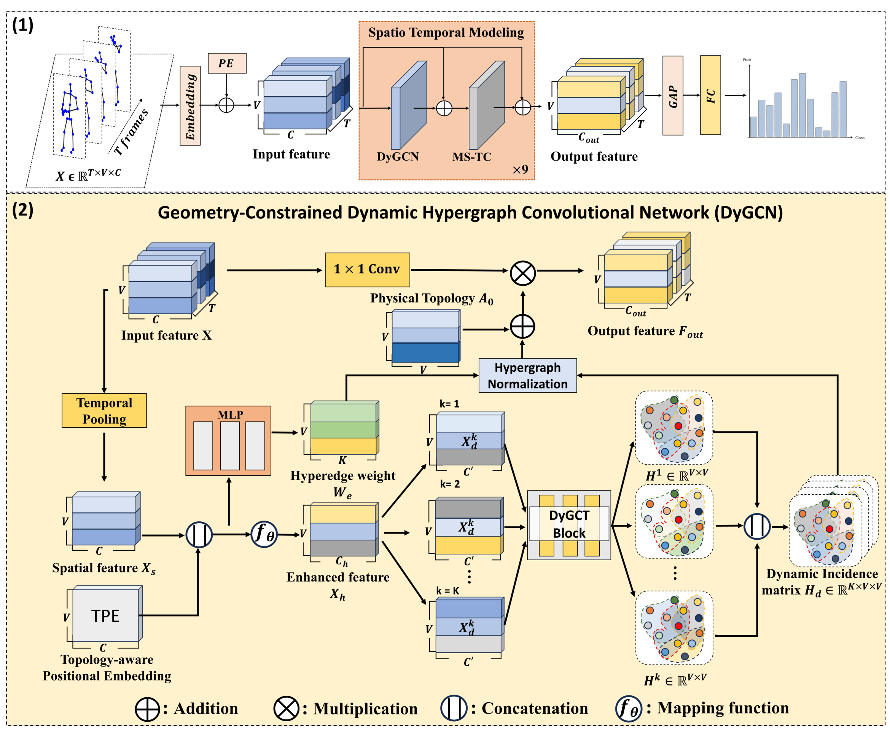
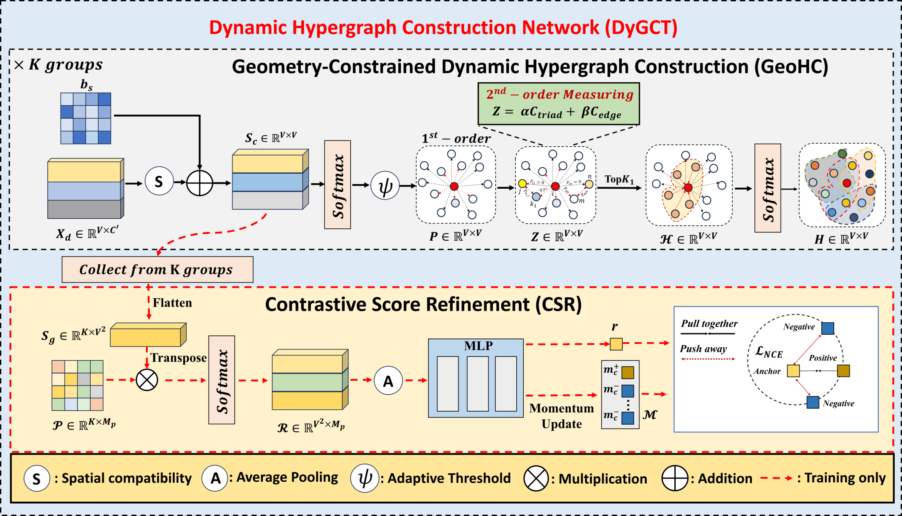
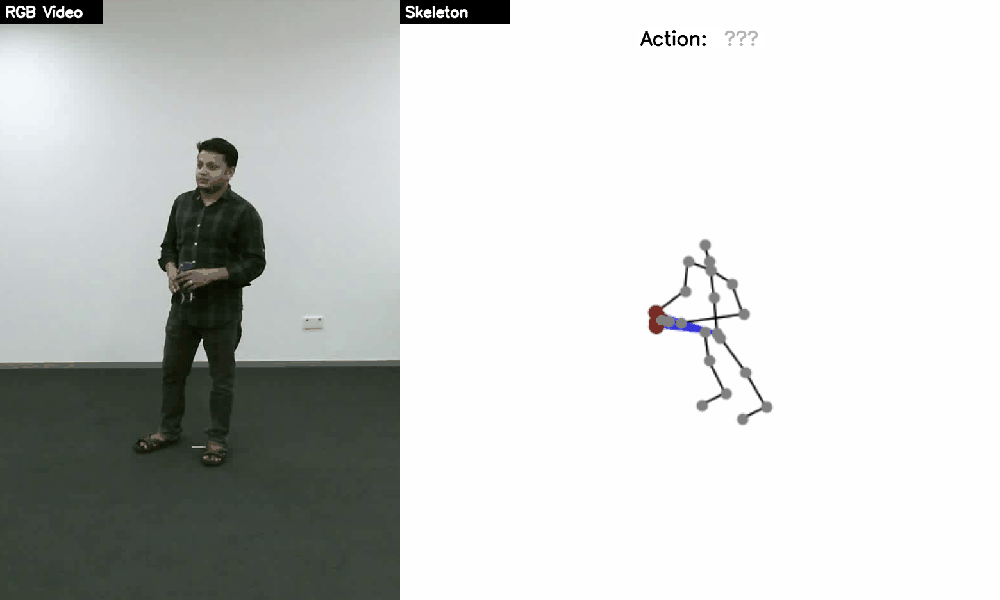

# <p align=center> DyGCN : Geometry-Constrained Dynamic Hypergraph Convolutional Network with Contrastive Score Refinement for Skeleton-Based Action Recognition </p>


> **Abstract:** *Skeleton-based action recognition is a pivotal task in computer vision; however, conventional Graph Convolutional Networks (GCNs) are often constrained by pairwise joint modeling, which fails to capture the intricate high-order interactions inherent in human movement. While recent hypergraph-based methods attempt to address this limitation, they typically rely on static structures derived from anatomical priors, lacking the flexibility to capture dynamic, action-specific joint correlations. To this end, we propose DyGCN, a Geometry-Constrained Dynamic Hypergraph Convolutional Network for skeleton-based action recognition. At the core of DyGCN is the Dynamic Hypergraph Construction Network with Contrastive Score Refinement (DyGCT) block, which comprises two novel components: the Geometry-Constrained Dynamic Hypergraph Construction (GeoHC) module and the Contrastive Score Refinement (CSR) module. Specifically, GeoHC dynamically constructs action-specific hyperedges by leveraging geometry-constrained second-order compatibility, transcending the limitations of static hyperedge structures. Furthermore, CSR explicitly refines the pairwise compatibility scores during hypergraph construction through prototype-based contrastive learning, fostering more discriminative action-specific hyperedges — with zero inference-time overhead as CSR operates only during training. Extensive experiments on NTU RGB+D, NTU RGB+D 120, and Northwestern-UCLA validate the effectiveness of DyGCN, achieving state-of-the-art performance on widely used benchmarks.* 

<p align="center">
     <br />
    <em> 
    Figure 1: Overview of the DyGCN framework..
    </em>
</p>


<p align="center">
     <br />
    <em> 
    Figure 2: The framework of the DyGCT block, comprising the Geometry-Constrained Dynamic Hypergraph Construction (GeoHC) module and the Contrastive Score Refinement (CSR) module.
    </em>
</p>

# Visualization
|  |  |  |
|:------------:|:------------:|:------------:|:------------:|
|*Brush Hair*|*Drink water*|*Stand up*|
# Prerequisites

- Python >= 3.6
- PyTorch >= 1.1.0
- PyYAML, tqdm, tensorboardX

- We provide the dependency file of our experimental environment, you can install all dependencies by creating a new anaconda virtual environment and running `pip install -r requirements.txt `

# Data Preparation

### Download datasets.

#### There are 3 datasets to download:

- NTU RGB+D 60 Skeleton
- NTU RGB+D 120 Skeleton
- NW-UCLA

#### NTU RGB+D 60 and 120

1. Request dataset here: https://rose1.ntu.edu.sg/dataset/actionRecognition
2. Download the skeleton-only datasets:
   1. `nturgbd_skeletons_s001_to_s017.zip` (NTU RGB+D 60)
   2. `nturgbd_skeletons_s018_to_s032.zip` (NTU RGB+D 120)
   3. Extract above files to `./data/nturgbd_raw`

#### NW-UCLA

1. Download dataset from [here](https://www.dropbox.com/s/10pcm4pksjy6mkq/all_sqe.zip?dl=0)
2. Move `all_sqe` to `./data/NW-UCLA`

### Data Processing

#### Directory Structure

Put downloaded data into the following directory structure:

```
- data/
  - NW-UCLA/
    - all_sqe
      ... # raw data of NW-UCLA
  - ntu/
  - ntu120/
  - nturgbd_raw/
    - nturgb+d_skeletons/     # from `nturgbd_skeletons_s001_to_s017.zip`
      ...
    - nturgb+d_skeletons120/  # from `nturgbd_skeletons_s018_to_s032.zip`
      ...
```

#### Generating Data

- Generate NTU RGB+D 60 or NTU RGB+D 120 dataset:

```
 cd ./data/ntu # or cd ./data/ntu120
 # Get skeleton of each performer
 python get_raw_skes_data.py
 # Remove the bad skeleton 
 python get_raw_denoised_data.py
 # Transform the skeleton to the center of the first frame
 python seq_transformation.py
```


# Training & Testing

### Training

- Change the config file depending on what you want.

```
# Example: training DyGCN on NTU RGB+D cross subject with GPU 0
# Joint modality
python main.py --config config/nturgbd-cross-subject/joint.yaml --work-dir work_dir/ntu/csub/joint --device 0
# Bone modality
python main.py --config config/nturgbd-cross-subject/bone.yaml --work-dir work_dir/ntu/csub/bone --device 0
```

- To train model on NTU RGB+D 60/120 with bone or motion modalities, setting `bone` or `vel` arguments in the config file.

### Testing

- To test the trained models saved in <work_dir>, run the following command:

```
python main.py --config <work_dir>/config.yaml --work-dir <work_dir> --phase test --save-score True --weights <work_dir>/xxx.pt --device 0
```

- To ensemble the results of different modalities, run 
```
# Example: ensemble four modalities of DyGCN on NTU RGB+D cross subject
python ensemble_test.py --dataset ntu/xsub \
--joint-dir work_dir/ntu/xsub/joint \
--bone-dir work_dir/ntu/xsub/bone \
--joint-motion-dir work_dir/ntu/xsub/joint_motion \
--bone-motion-dir work_dir/ntu/xsub/bone_motion
```
## Acknowledgements

This repo is based on [CTR-GCN](https://github.com/Uason-Chen/CTR-GCN/tree/main) . 
The data processing is borrowed from [SGN](https://github.com/microsoft/SGN) and [STA-GCN](https://github.com/huguyuehuhu/HCN-pytorch). 
The training strategy is referenced from [BlockGCN](https://github.com/ZhouYuxuanYX/BlockGCN) and [Hyper-GCN](https://github.com/6UOOON9/Hyper-GCN).\
Many thanks to the original authors for their work!
# Citation
```
```
